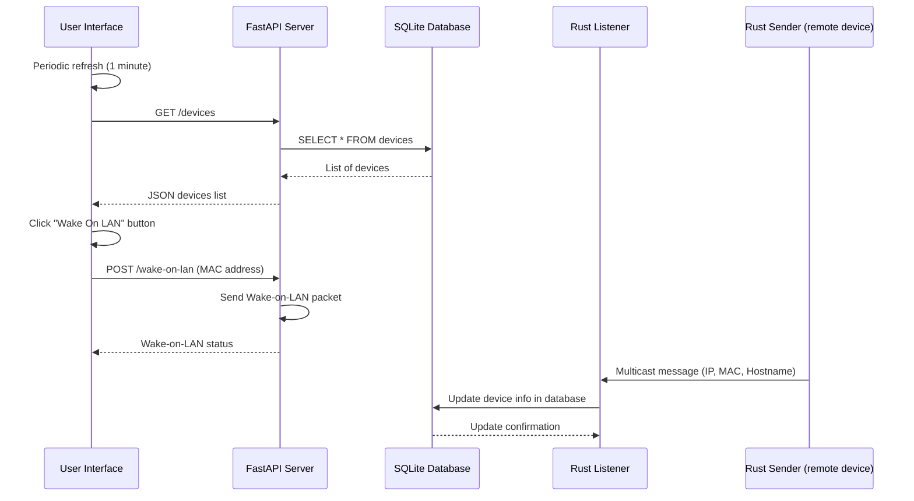

# Remote device management tools

A local network device management system built using FastAPI, React, and Rust.

Currently only sends Wake-on-LAN packets, though I'd love to add more features in the future.

My personal use case is to wake up my home server when I'm away from home (or even just in another room).  I run the web frontend on a Raspberry Pi and the listener on my server.  Both are connected to the same Tailscale network, so I can access the web frontend from anywhere.

## Overview

This system is composed of four main components:

FastAPI server: Serves the API for serving device information and sending Wake-on-LAN requests.
React frontend: A user interface for displaying the list of devices and triggering Wake-on-LAN requests.
Rust listener: Listens for multicast messages and updates the SQLite database with device information.
Rust sender: Sends multicast messages with device information (IP, MAC, and hostname) at a regular interval.

