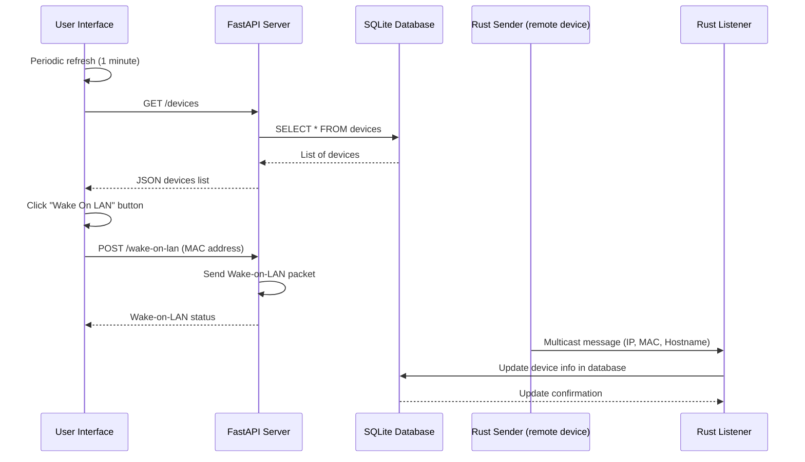

# Remote device management tools

This repository contains tools for the managing of remote devices on a local network.

```mermaid
sequenceDiagram
    participant UI as User Interface
    participant API as FastAPI Server
    participant DB as SQLite Database
    participant Sender as Rust Sender (remote device)
    participant Listener as Rust Listener

    UI->>UI: Periodic refresh (1 minute)
    UI->>API: GET /devices
    API->>DB: SELECT * FROM devices
    DB-->>API: List of devices
    API-->>UI: JSON devices list

    UI->>UI: Click "Wake On LAN" button
    UI->>API: POST /wake-on-lan (MAC address)
    API->>API: Send Wake-on-LAN packet
    API-->>UI: Wake-on-LAN status

    Sender->>Listener: Multicast message (IP, MAC, Hostname)
    Listener->>DB: Update device info in database
    DB-->>Listener: Update confirmation
```